# Xilinx FPGA Tutorial

```
Author : 
    Jyun-Liang, Chen
    Pin-Lun, Lin
```

## 1. Outline
- [Xilinx FPGA Tutorial](#Xilinx-FPGA-Tutorial)
  - [1. Outline](#1-Outline)
  - [2. Introduction](#2-Introduction)
  - [3. Vivado](#3-Vivado)
      - [3.1 Requirement](#31-Requirement)
      - [3.2 Create IP Package](#32-Create-IP-Package)
      - [3.3 Create Block Diagrame](#33-Create-Block-Diagrame)
  - [4. SDK](#4-SDK)
      - [4.1 Create Project](#41-Create-Project)
      - [4.2 Standalone Driver](#42-Standalone-Driver)


## 2. Introduction

**TODO**

------

## 3. Vivado

#### 3.1 Requirement

- Install vivado
- Create a vivado project.
- Import your RTL design.
- Check your design don't have bug.

In this tutorial, I use：

- Xilinx Vivado 2018.3
- Petalinux 2018.3
- CentOS 7 on Server
- Ubuntu 18.04 Arm 64bits Server Edition on FPGA
- ZCU102

Following is the RTL sample in this tutorial：

```Verilog
module calculator #(
    parameter DATA_BW = 16
) (
    input                       clk,
    input                       rst,
    input      [DATA_BW-1:0]    din0,
    input      [DATA_BW-1:0]    din1,
    output reg [DATA_BW:0]      sum,
    output reg [DATA_BW*2-1:0]  product
);
    always@(posedge clk) begin
        if(rst) begin
            sum     <= {(DATA_BW+1){1'b0}};
            product <= {(DATA_BW*2){1'b0}};
        end else begin
            sum     <= din0 + din1;
            product <= din0 * din1;
        end
    end
endmodule
```

#### 3.2 Create IP Package

首先建立Vivado專案並匯入前述的RTL程式碼，接著開始將硬體封裝成IP。

>File &rarr; Create and Package New IP... &rarr; Next

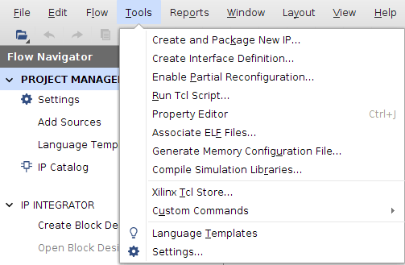

>Create a new AXI4 peripheral &rarr; Next

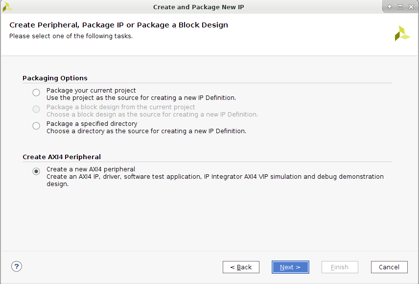

>定義IP名字和路徑 &rarr; Next


>此處先選擇AXI-Lite Slave的Wrapper當作入門，Number of Registers根據硬體有多少IO Ports決定 (clk、rst除外)


>Edit IP &rarr; Finish


完成後會跳出新專案的視窗，需重新加入原本的RTL檔案，變成下列的檔案階層\

```plaintext
├──myip_v1_0.v
|  ├──myip_v1_0_S00_AXI.v
|  |  └──tutorial.v
|  └──
└──
```

匯入檔案後須修改Wrapper內的程式碼

>於myip_v1_0_S00_AXI.v的開頭宣告parameter

```Verilog
6   // Users to add parameters here
7   parameter DATA_BW = 16, 
8   // User parameters ends
9   // Do not modify the parameters beyond this line
```

>宣告輸出的Wire並連接到下列多工器

```Verilog
365 // Implement memory mapped register select and read logic generation
366 // Slave register read enable is asserted when valid address is available
367 // and the slave is ready to accept the read address.
368 wire [DATA_BW:0]     sum;
369 wire [DATA_BW*2-1:0] product;
370
371 assign slv_reg_rden = axi_arready & S_AXI_ARVALID & ~axi_rvalid;
372
373 always @(*)
374 begin
375     // Address decoding for reading registers
376     case ( axi_araddr[ADDR_LSB+OPT_MEM_ADDR_BITS:ADDR_LSB] )
377         2'h0    : reg_data_out <= slv_reg0;
378         2'h1    : reg_data_out <= slv_reg1;
379         2'h2    : reg_data_out <= sum;
380         2'h3    : reg_data_out <= product;
381         default : reg_data_out <= 0;
382     endcase
383 end
```

>呼叫先前的Module並接線

```Verilog
404 // Add user logic here
405 calculator #(
406     .DATA_BW (DATA_BW)
407 ) u_calculator (
408     .clk    (S_AXI_ACLK),
409     .rst    (S_AXI_ARESETN),
410     .din0   (slv_reg0),
411     .din1   (slv_reg1),
412     .sum    (sum),
413     .product(product)
414 );
415 // User logic ends
```

>myip_v1_0_S00_AXI.v修改後接著修改myip_v1_0.v

>宣告Parameter

```Verilog
6   // Users to add parameters here
7   parameter DATA_BW = 16,
8   // User parameters ends
9   // Do not modify the parameters beyond this

......

47  myip_v1_0_S00_AXI # (
48     .DATA_BW (DATA_BW),
49     .C_S_AXI_DATA_WIDTH(C_S00_AXI_DATA_WIDTH),
50     .C_S_AXI_ADDR_WIDTH(C_S00_AXI_ADDR_WIDTH)
```

Wrapper的簡易架構圖如下 :


修改後打開component.xml

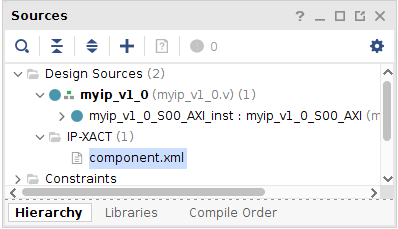

>不是綠勾的項目先點進去後 &rarr; Merge changes from XXX Wizard


------

**以下共有4個Case分別解釋，若沒有遇到以下的Case可跳過**

**Case 1**

若IP有複數個AXI協定，並且要共用同一個Clock Source
>Ports and Interface &rarr; 右鍵欲共用Clock的**所有**AXI協定 &rarr; Associate Clocks... &rarr; 勾選該Clock Source

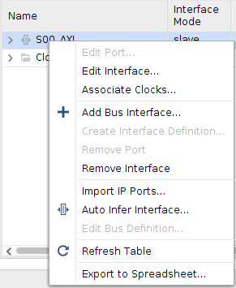


**Case 2**

若Wrapper是自己寫的，需要自己手動生成匯流排的介面

>Ports and Interface &rarr; Add Bus Interface...

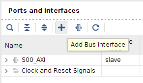

>填入介面的名字 &rarr; 選擇匯流排的模式

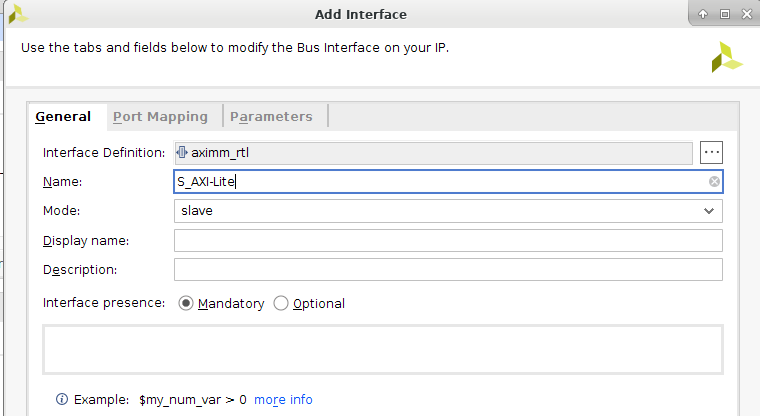

>切換到Port Mapping頁面將左右兩欄相同的Port選取後 &rarr; Map Ports &rarr; 全部的Port都Map完後按OK

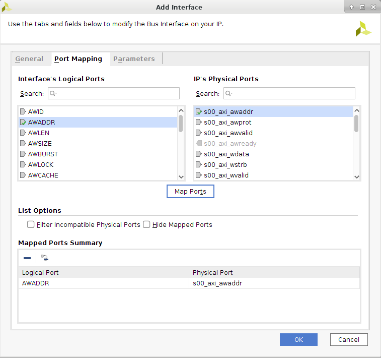

**Case 3**

若有Interrupt訊號，需要自己手動設定格式

>Ports and Interface &rarr; Add Bus Interface... (圖同Case2)

>選擇介面的定義 &rarr; 填入介面的名字 &rarr; 選擇匯流排的格式(通常為Master)


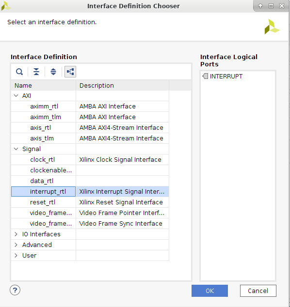

>切換到Port Mapping頁面將左右兩欄相同的Port選取後 &rarr; Map Ports &rarr; 全部的Port都Map完後按OK

**Case 4**

若有RTL程式碼內有Parameter希望能夠從IP的GUI設定

>Customization GUI &rarr; 將Hidden Parameters移動到Window的欄位下
>(也可以先Add Page / Group後移動到Page / Group下)


******

IP全部設定完成後
>Review and Package &rarr; Re-package IP &rarr; 若還會修改IP則選No


#### 3.3 Create Block Diagrame

首先須建立一個新專案，

接著建立Block Design
>Create Block Design &rarr; OK


將2.2節封裝好的IP加入專案
>Settings &rarr; IP &rarr; Repository &rarr; Add &rarr; (Path of IP) &rarr; OK &rarr; OK


在Block Diagrame內呼叫IP以及PS端的IP

>Diagrame &rarr; Add IP &rarr; Zynq UltraScale+ MPSoC


>Diagrame &rarr; Add IP &rarr; myip_v1.0


自動設定ZynqMP的IP

>Run Block Automation &rarr; OK


根據需求調整ZynqMP的Port數以及Bandwidth

>左鍵雙擊IP &rarr; PS-PL Configuration &rarr; PS-PL Interfate

**Note : 各個Port的介紹**

| Port        |                      用途                       |
| :---------- | :---------------------------------------------: |
| AXI_HPM_FPD |                高速的Master Port           |
| AXI_HPM_LPD |                低速的Master Port                |
| AXI_HPC_FPD |  高速且可以支援硬體Cache Coherent的Slave Port   |
| AXI_HP_FPD  |                高速的Slave Port                 |
| AXI_LPD     |                低速的Slave Port                 |
| S_AXI_ACP   | 可以支援硬體Cache Coherent的Slave Port (不確定) |
| S_AXI_ACE   |                     不清楚                      |

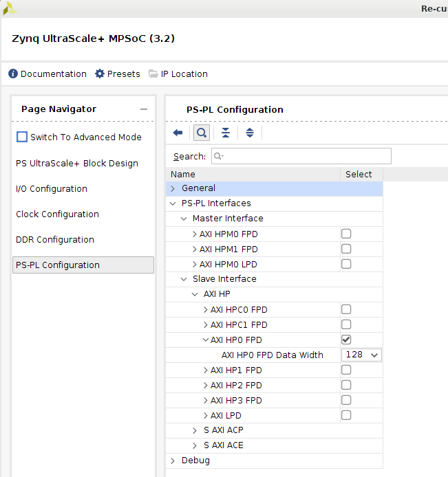

若有IP有Interrupt的需求

>左鍵雙擊IP &rarr; PS-PL Configuration &rarr; General &rarr; Interrupts &rarr; PL to PS

**Note : IRQ0和IRQ1各7bits可以支援共14條IRQ訊號，但必須用Concate IP將7條以內的IRQ合併成一條後接到Zynq的IP上**

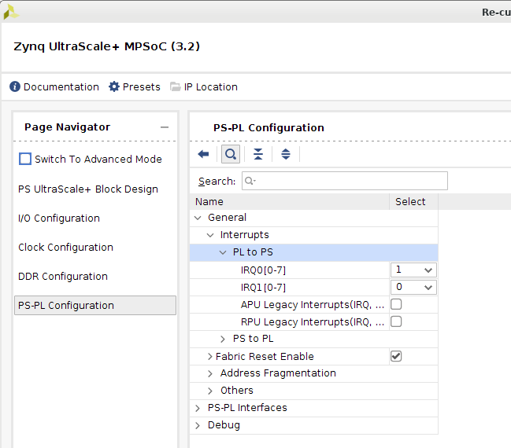

調整時脈

>左鍵雙擊IP &rarr; Clock Configuration &rarr; Output Clocks &rarr; Low Power Domain Clocks &rarr; PL Fabric Clocks &rarr; 根據需求勾選要幾個Clock Source &rarr; 設定Requested Freq (MHz) &rarr; OK


ZynqMP的IP設定完後，將ZynqMP和my_IP的Port相接

>Run Connection Automation (有時候會接錯，要手動調整)


接完後如下


在所有線接完後可以按Regenerate Layout重新排列IP


檢查Address Editor內有賦予IP地址，若有需求，地址可手動修改；**另外地址會於SDK或是Device Tree用到**


接著按Validate Design確認沒有Error或Critical Warning並盡量將Warning修正掉


Block Diagrame驗證完成後，需要建立由RTL編寫的Top Module

>右鍵Block Diagrame的.db檔 &rarr; Create HDL Wrapper... &rarr; Let Vivado manage wrapper and auto-update &rarr; OK


最後按Generate Bitstream做Synthesis and Implementation


**合成完成後確認沒有Error，Critical Warning和Warning需檢查是否會影響電路功能**

------

**Special Case :** 若Block Diagrame完成後，又重新修改IP，則Block Diagrame會出現Refresh IP Catalog

>Refresh IP Catalog 


按下Refresh IP Catalog後下方會出現IP Status的小視窗

>Upgrade Select &rarr; OK


>Out of Context Per IP &rarr; Generate &rarr; OK


**Note : 有時候Refresh IP Catalog會失敗，需自行檢查，若失敗建議將.bd檔刪除並重新建立Block Diagrame，或是整個專案刪除重建**

------

## 4. SDK

#### 4.1 Create Project

確認 **Generate Bitstream** 完成

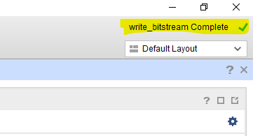

之後將 **Bitstream** 匯入至 **SDK**

> File &rarr; Export &rarr; Export Hardware...


開啟**SDK**

> File &rarr; Launch SDK

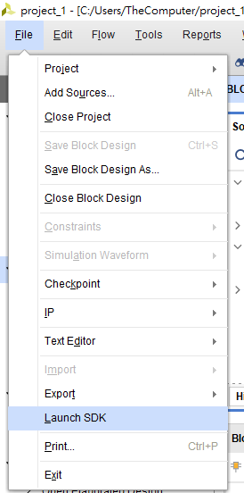

**SDK**


創建一個專案

> File &rarr; New &rarr; Application Project

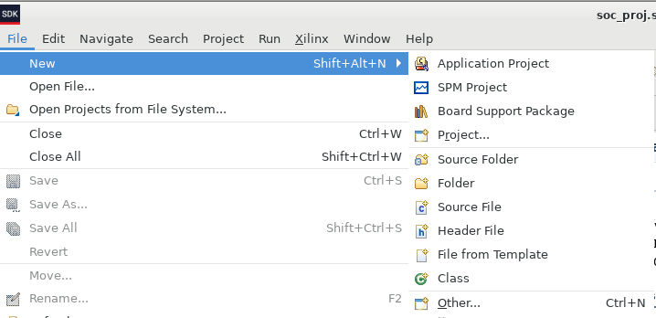

創建一個 Hello World 的 _Template_ (**Project Name** 任意取)


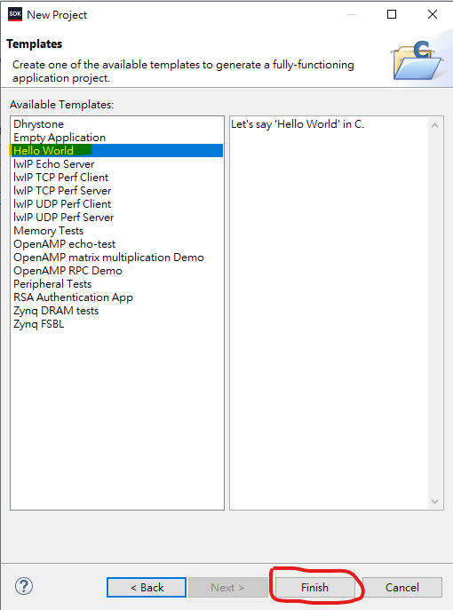

將2條 _Micro-USB to USB_ 的線分別插入 _USB Uart_ 以及 _JTAG/Debug_ (在 _Power_ 跟 _Audio I/O_ 之間)


將 **Bitstream** 檔燒入至 **Zedboard**

> Xilinx &rarr; Program FPGA

or

> Click Toolbar
> 


之後會跳出一個視窗，確認**Bitstream**無誤之後就可以按下**Program**


按下**Program**之後，會跳出一個視窗等到他跑完為止。

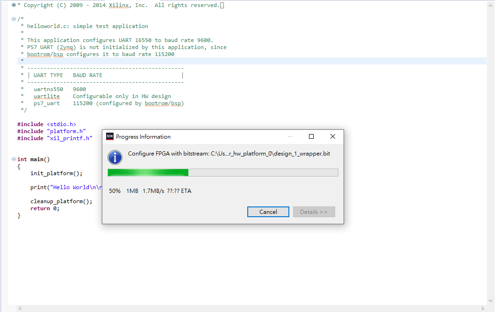

燒入成功之後，**Zedboard**會亮藍燈。


開啟**SDK Terminal**


若找不到可以從這邊開啟

> Window &rarr; Show View  &rarr; Other...

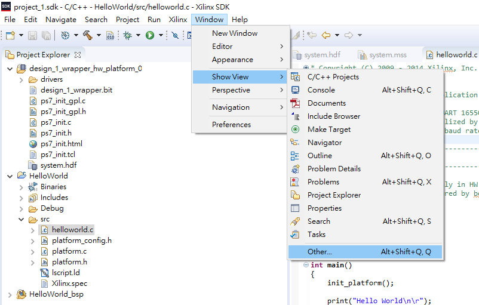

輸入**SDK Terminal**


設定 _Port_ 以及 _Baud Rate_

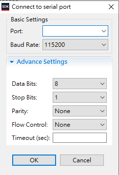

在 _Windows_ 環境中，需要從 _裝置管理員_ 查看 _USB Serial Port_ 為多少。
以圖片為例， _Port_ 需要設為 _COM4_ 。


設定完之後，運行Hello World程式碼。
>Right Click Project
>
>Run as &rarr; Launch on Hardware (System Debugger)
>
>or
>
>Click Toolbar 


觀察**SDK Terminal**是否有印出Hello World。


#### 4.2 Standalone Driver

更改main.c

```C
#include <stdio.h>
#include "platform.h"
#include "xil_printf.h"

int main()
{
    init_platform();

    int *baseaddr = (int *)0x43c00000;
    baseaddr[0] = 10;
    baseaddr[1] = 2;
    printf("Sum = %d\nSubtract =  %d\nMultiplication = %d\n
            Division = %d\n",baseaddr[0],baseaddr[1],baseaddr[2],
            baseaddr[3]); //slv_reg0 operator slv_reg1
    cleanup_platform();
    return 0;
}
```

首先 _**baseaddr**_ 為宣告一 _int_ 的指標，指向的內容為一實體記憶體位址。

這邊 _**baseaddr[1]**_ 跟 _***(baseaddr+4)**_ 是一樣的意思，因為這邊宣告 _**baseaddr[1]**_ 為 _int_ 的指標， _int_ 為32 _bit_ 就是4 _byte_ ，每一個記憶體位址都能儲存1 _byte_ 的資料，所以這邊根據 _C Compiler_ 的因素， _int_ 的陣列[1]會自動從起始記憶體位址加4。

剛好實際上**IP**的每個暫存器都是為32 _bit_，所以可以剛好對上。

這邊將 _**baseaddr**_ 指定為 _**0x43c0_0000**_ 為實際對上**Slave Port**的 _Bus Address_ ，這項資訊可以在下圖中得知。


運行之後的結果為下圖。


