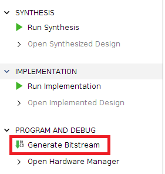
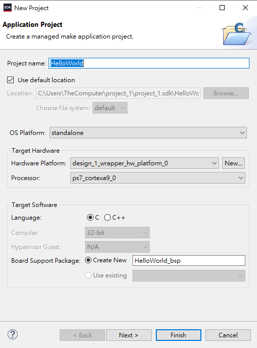
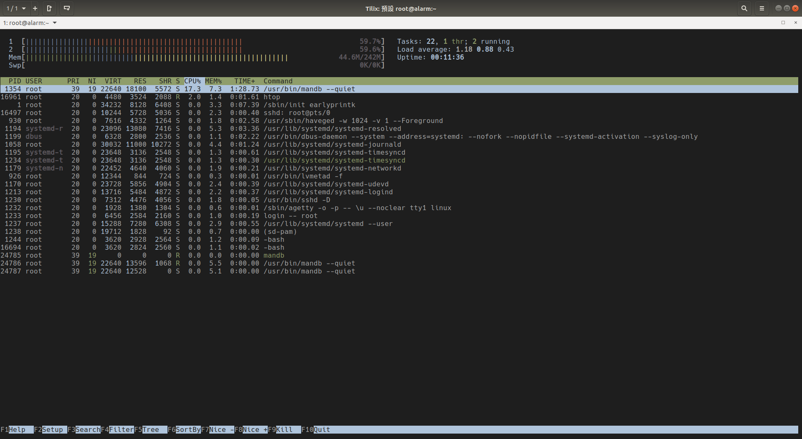
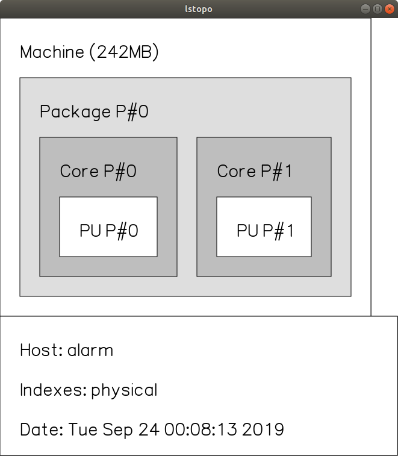

# Lab1

```
Author : 
    Jyun-Liang, Chen
    Pin-Lun, Lin
```
## 1. Outline
- [Lab1](#lab1)
  - [1. Outline](#1-outline)
  - [2. Vivado](#2-vivado)
    - [2.1 Requirement](#21-requirement)
    - [2.2 Create Vivado Project](#22-create-vivado-project)
      - [2.2.1 New a project](#221-new-a-project)
      - [2.2.2 Click Next](#222-click-next)
      - [2.2.3 Input Your Project Name and Location](#223-input-your-project-name-and-location)
      - [2.2.4 Check Option](#224-check-option)
      - [2.2.5 Choose ZedBoard Zynq](#225-choose-zedboard-zynq)
      - [2.2.6 Click Finish](#226-click-finish)
      - [2.2.7 Click Create Block Design](#227-click-create-block-design)
      - [2.2.8 Input Block Design before Click OK](#228-input-block-design-before-click-ok)
      - [2.2.9 Click Icon and Double Click ZYNQ7 Processing System](#229-click-icon-and-double-click-zynq7-processing-system)
      - [2.2.10 Click Run Block Automation](#2210-click-run-block-automation)
      - [2.2.11 Connect FCLK_CLK_0 to M_AXI_GP0_ACLK](#2211-connect-fclkclk0-to-maxigp0aclk)
      - [2.2.12 接著按Validate Design確認沒有Error或Critical Warning並盡量將Warning修正掉](#2212-%e6%8e%a5%e8%91%97%e6%8c%89validate-design%e7%a2%ba%e8%aa%8d%e6%b2%92%e6%9c%89error%e6%88%96critical-warning%e4%b8%a6%e7%9b%a1%e9%87%8f%e5%b0%87warning%e4%bf%ae%e6%ad%a3%e6%8e%89)
      - [2.2.13 Block Diagrame驗證完成後，需要建立由RTL編寫的Top Module](#2213-block-diagrame%e9%a9%97%e8%ad%89%e5%ae%8c%e6%88%90%e5%be%8c%e9%9c%80%e8%a6%81%e5%bb%ba%e7%ab%8b%e7%94%b1rtl%e7%b7%a8%e5%af%ab%e7%9a%84top-module)
      - [2.2.14 最後按Generate Bitstream做Synthesis and Implementation](#2214-%e6%9c%80%e5%be%8c%e6%8c%89generate-bitstream%e5%81%9asynthesis-and-implementation)
      - [2.2.15 合成完成後確認沒有Error，Critical Warning和Warning需檢查是否會影響電路功能](#2215-%e5%90%88%e6%88%90%e5%ae%8c%e6%88%90%e5%be%8c%e7%a2%ba%e8%aa%8d%e6%b2%92%e6%9c%89errorcritical-warning%e5%92%8cwarning%e9%9c%80%e6%aa%a2%e6%9f%a5%e6%98%af%e5%90%a6%e6%9c%83%e5%bd%b1%e9%9f%bf%e9%9b%bb%e8%b7%af%e5%8a%9f%e8%83%bd)
      - [2.2.16 確認 Generate Bitstream 完成](#2216-%e7%a2%ba%e8%aa%8d-generate-bitstream-%e5%ae%8c%e6%88%90)
    - [2.3 Vivado SDK](#23-vivado-sdk)
      - [2.3.1 之後將 **Bitstream** 匯入至 **SDK**](#231-%e4%b9%8b%e5%be%8c%e5%b0%87-bitstream-%e5%8c%af%e5%85%a5%e8%87%b3-sdk)
      - [2.3.2 開啟SDK](#232-%e9%96%8b%e5%95%9fsdk)
      - [2.3.3 SDK](#233-sdk)
      - [2.3.4 建立專案](#234-%e5%bb%ba%e7%ab%8b%e5%b0%88%e6%a1%88)
      - [2.3.5 設定Project Name](#235-%e8%a8%ad%e5%ae%9aproject-name)
      - [2.3.6 選擇空專案的模版](#236-%e9%81%b8%e6%93%87%e7%a9%ba%e5%b0%88%e6%a1%88%e7%9a%84%e6%a8%a1%e7%89%88)
      - [2.3.7 將2條 Micro-USB to USB 的線分別插入 USB Uart 以及 USB JTAG](#237-%e5%b0%872%e6%a2%9d-micro-usb-to-usb-%e7%9a%84%e7%b7%9a%e5%88%86%e5%88%a5%e6%8f%92%e5%85%a5-usb-uart-%e4%bb%a5%e5%8f%8a-usb-jtag)
      - [2.3.8 將 Bitstream 檔燒入至 Zedboard](#238-%e5%b0%87-bitstream-%e6%aa%94%e7%87%92%e5%85%a5%e8%87%b3-zedboard)
      - [2.3.9 之後會跳出一個視窗，確認*Bitstream*無誤之後就可以按下*Program*](#239-%e4%b9%8b%e5%be%8c%e6%9c%83%e8%b7%b3%e5%87%ba%e4%b8%80%e5%80%8b%e8%a6%96%e7%aa%97%e7%a2%ba%e8%aa%8dbitstream%e7%84%a1%e8%aa%a4%e4%b9%8b%e5%be%8c%e5%b0%b1%e5%8f%af%e4%bb%a5%e6%8c%89%e4%b8%8bprogram)
      - [2.3.10 按下Program之後，會跳出一個視窗等到他跑完為止。](#2310-%e6%8c%89%e4%b8%8bprogram%e4%b9%8b%e5%be%8c%e6%9c%83%e8%b7%b3%e5%87%ba%e4%b8%80%e5%80%8b%e8%a6%96%e7%aa%97%e7%ad%89%e5%88%b0%e4%bb%96%e8%b7%91%e5%ae%8c%e7%82%ba%e6%ad%a2)
      - [2.3.11 燒入成功之後，Zedboard會亮藍燈。](#2311-%e7%87%92%e5%85%a5%e6%88%90%e5%8a%9f%e4%b9%8b%e5%be%8czedboard%e6%9c%83%e4%ba%ae%e8%97%8d%e7%87%88)
      - [2.3.12 開啟SDK Terminal](#2312-%e9%96%8b%e5%95%9fsdk-terminal)
      - [2.3.13 輸入SDK Terminal](#2313-%e8%bc%b8%e5%85%a5sdk-terminal)
      - [2.3.14 Setting Port and Baud Rate](#2314-setting-port-and-baud-rate)
      - [2.3.15 在 Windows 環境中，需要從 裝置管理員 查看 USB Serial Port 為多少。](#2315-%e5%9c%a8-windows-%e7%92%b0%e5%a2%83%e4%b8%ad%e9%9c%80%e8%a6%81%e5%be%9e-%e8%a3%9d%e7%bd%ae%e7%ae%a1%e7%90%86%e5%93%a1-%e6%9f%a5%e7%9c%8b-usb-serial-port-%e7%82%ba%e5%a4%9a%e5%b0%91)
      - [2.3.16 設定完之後，運行Hello World程式碼。](#2316-%e8%a8%ad%e5%ae%9a%e5%ae%8c%e4%b9%8b%e5%be%8c%e9%81%8b%e8%a1%8chello-world%e7%a8%8b%e5%bc%8f%e7%a2%bc)
      - [2.3.17 觀察SDK Terminal是否有印出Hello World。](#2317-%e8%a7%80%e5%af%9fsdk-terminal%e6%98%af%e5%90%a6%e6%9c%89%e5%8d%b0%e5%87%bahello-world)
  - [3. Petalinux](#3-petalinux)
    - [3.1 Requirement](#31-requirement)
    - [3.2 Petalinux Command](#32-petalinux-command)
    - [3.3 Create Project](#33-create-project)
      - [3.3.1 Create Petalinux Project](#331-create-petalinux-project)
      - [3.3.2 Setting Petalinux Project](#332-setting-petalinux-project)
      - [3.3.3 Setting Bootloader](#333-setting-bootloader)
      - [3.3.4 Check Option](#334-check-option)
      - [3.3.5 Edit Argument](#335-edit-argument)
      - [3.3.6 Save and Exit](#336-save-and-exit)
      - [3.3.7 Build](#337-build)
      - [3.3.8 Package](#338-package)
      - [3.3.9 Check File](#339-check-file)
  - [4. ArchLinux](#4-archlinux)
    - [4.1 Requirement](#41-requirement)
    - [4.2 Prepare SD Card](#42-prepare-sd-card)
      - [4.2.1 Check SD Card](#421-check-sd-card)
        - [4.2.1.1 插入 SD Card 前](#4211-%e6%8f%92%e5%85%a5-sd-card-%e5%89%8d)
        - [4.2.1.2 插入 SD Card 後](#4212-%e6%8f%92%e5%85%a5-sd-card-%e5%be%8c)
        - [4.2.1.3 Check Infomation](#4213-check-infomation)
        - [4.2.1.4 Get \"\/dev\/sdc\" Information](#4214-get-%22devsdc%22-information)
      - [4.2.2 清空 SD Card](#422-%e6%b8%85%e7%a9%ba-sd-card)
      - [4.2.3 獨立切割100MB](#423-%e7%8d%a8%e7%ab%8b%e5%88%87%e5%89%b2100mb)
      - [4.2.4 設定剩餘空間](#424-%e8%a8%ad%e5%ae%9a%e5%89%a9%e9%a4%98%e7%a9%ba%e9%96%93)
      - [4.2.5 Change 100MB EXT4 to 100MB FAT32](#425-change-100mb-ext4-to-100mb-fat32)
        - [4.2.5.1 Print Filesystem List](#4251-print-filesystem-list)
        - [4.2.5.2 Choose FAT32 and Save](#4252-choose-fat32-and-save)
      - [4.2.6 Setting SD Card Filesystem](#426-setting-sd-card-filesystem)
    - [4.3 Prepare Boot ArchLinux](#43-prepare-boot-archlinux)
      - [4.3.1 Download ArchLinux](#431-download-archlinux)
      - [4.3.2 Copy ArchLinuxARM-zedboard to SD Card EXT4](#432-copy-archlinuxarm-zedboard-to-sd-card-ext4)
      - [4.3.3 Copy BOOT.BIN and image.ub to SD Card FAT32](#433-copy-bootbin-and-imageub-to-sd-card-fat32)
      - [4.3.4 將FPGA設定為SD Card開機模式，插入SD Card、Uart以及網路線並且開機。](#434-%e5%b0%87fpga%e8%a8%ad%e5%ae%9a%e7%82%basd-card%e9%96%8b%e6%a9%9f%e6%a8%a1%e5%bc%8f%e6%8f%92%e5%85%a5sd-carduart%e4%bb%a5%e5%8f%8a%e7%b6%b2%e8%b7%af%e7%b7%9a%e4%b8%a6%e4%b8%94%e9%96%8b%e6%a9%9f)
    - [4.4 Print Hello World](#44-print-hello-world)
      - [4.4.1 Use Putty](#441-use-putty)
      - [4.4.2 Setting Network (Static)](#442-setting-network-static)
      - [4.4.3 Setting Network (Dynamic)](#443-setting-network-dynamic)
      - [4.4.4 Using Pacman](#444-using-pacman)
  - [(基礎)Test : Print Hello World(Using C++)](#%e5%9f%ba%e7%a4%8etest--print-hello-worldusing-c)
  - [(進階)Print Fibonacci number](#%e9%80%b2%e9%9a%8eprint-fibonacci-number)
  - [(加分)Float(IEEE-754) 轉成 Integer(Use pointer)](#%e5%8a%a0%e5%88%86floatieee-754-%e8%bd%89%e6%88%90-integeruse-pointer)

## 2. Vivado
### 2.1 Requirement

- Install vivado.
- Create a vivado project.
- Create block design.
- Import ZYNQ.
- Generate Bitstream.

In this tutorial, I use：

- Xilinx Vivado 2018.3
- Ubuntu 18.04
- Zedboard

### 2.2 Create Vivado Project
#### 2.2.1 New a project
>>File &rarr; Project &rarr; New...


#### 2.2.2 Click Next


#### 2.2.3 Input Your Project Name and Location


#### 2.2.4 Check Option


#### 2.2.5 Choose ZedBoard Zynq


#### 2.2.6 Click Finish


#### 2.2.7 Click Create Block Design


#### 2.2.8 Input Block Design before Click OK


#### 2.2.9 Click Icon and Double Click ZYNQ7 Processing System
- Click 


#### 2.2.10 Click Run Block Automation
- Click 


#### 2.2.11 Connect FCLK_CLK_0 to M_AXI_GP0_ACLK


#### 2.2.12 接著按Validate Design確認沒有Error或Critical Warning並盡量將Warning修正掉


#### 2.2.13 Block Diagrame驗證完成後，需要建立由RTL編寫的Top Module

>右鍵Block Diagrame的.bd檔 &rarr; Create HDL Wrapper... &rarr; Let Vivado manage wrapper and auto-update &rarr; OK


#### 2.2.14 最後按Generate Bitstream做Synthesis and Implementation



#### 2.2.15 合成完成後確認沒有Error，Critical Warning和Warning需檢查是否會影響電路功能

#### 2.2.16 確認 Generate Bitstream 完成


### 2.3 Vivado SDK

#### 2.3.1 之後將 **Bitstream** 匯入至 **SDK**

> File &rarr; Export &rarr; Export Hardware...


#### 2.3.2 開啟SDK

> File &rarr; Launch SDK


#### 2.3.3 SDK


#### 2.3.4 建立專案

> File &rarr; New &rarr; Application Project


#### 2.3.5 設定Project Name



#### 2.3.6 選擇空專案的模版


#### 2.3.7 將2條 Micro-USB to USB 的線分別插入 USB Uart 以及 USB JTAG


#### 2.3.8 將 Bitstream 檔燒入至 Zedboard

> Xilinx &rarr; Program FPGA
>
> or
>
> Click Toolbar
> 


#### 2.3.9 之後會跳出一個視窗，確認*Bitstream*無誤之後就可以按下*Program*


#### 2.3.10 按下Program之後，會跳出一個視窗等到他跑完為止。


#### 2.3.11 燒入成功之後，Zedboard會亮藍燈。


#### 2.3.12 開啟SDK Terminal


- 若找不到可以從這邊開啟

> Window &rarr; Show View  &rarr; Other...


#### 2.3.13  輸入SDK Terminal


#### 2.3.14 Setting Port and Baud Rate


#### 2.3.15 在 Windows 環境中，需要從 裝置管理員 查看 USB Serial Port 為多少。
- 以圖片為例， _Port_ 需要設為 _COM4_ 。


#### 2.3.16 設定完之後，運行Hello World程式碼。
>Right Click Project
>
>Run as &rarr; Launch on Hardware (System Debugger)
>
>or
>
>Click Toolbar 


#### 2.3.17 觀察SDK Terminal是否有印出Hello World。


## 3. Petalinux

### 3.1 Requirement

- SSH to Server.
- Create a Petalinux project.
- HDF File(Vivado generate).

In this tutorial, I use：

- Xilinx Vivado 2018.3
- Xilinx Petalinux 2018.3
- Ubuntu 18.04

### 3.2 Petalinux Command

```sh
source <PATH_to_PETALINUX>/settings.sh
```
- Note : 查看各指令的說明

``` sh
petalinux-XXX -h
```


### 3.3 Create Project

#### 3.3.1 Create Petalinux Project
```bash
petalinux-create -t project -s avnet-digilent-zedboard-v2018.3-final.bsp
```
- Note : **必須**把工作環境切換至Petalinux專案資料夾裡面
```bash
cd <Path_to_Petalinux_Project>/<Petalinux_project_name>
```
#### 3.3.2 Setting Petalinux Project
```bash
petalinux-config --get-hw-description=<存放HDF檔的路徑>
```
#### 3.3.3 Setting Bootloader
>Image Packaging Configuration  &rarr; Root filesystem type
>
>Choose SD Card


>> DTG Settings &rarr; Kernel Bootargs


#### 3.3.4 Check Option


#### 3.3.5 Edit Argument
```
earlycon clk_ignore_unused earlyprintk root=/dev/mmcblk0p2 rw rootwait cma=512M
```


#### 3.3.6 Save and Exit


#### 3.3.7 Build
```bash
petalinux-build
```

#### 3.3.8 Package
```bash
petalinux-package --boot --fpga images/linux/system.bit --fsbl images/linux/zynq_fsbl.elf --u-boot images/linux/u-boot.elf --force
```

#### 3.3.9 Check File
- BOOT.BIN & image.ub
```bash
ls image/linux/
```


## 4. ArchLinux

### 4.1 Requirement

- Ubuntu 18.04.
- Archlinux Arm-32bit.

### 4.2 Prepare SD Card

#### 4.2.1 Check SD Card

##### 4.2.1.1 插入 SD Card 前
```bash
ls /dev/sd*
```


##### 4.2.1.2 插入 SD Card 後
```bash
ls /dev/sd*
```


##### 4.2.1.3 Check Infomation
```bash
fdisk /dev/sdc
```


##### 4.2.1.4 Get \"\/dev\/sdc\" Information
>> Input p


#### 4.2.2 清空 SD Card
>> Input d


#### 4.2.3 獨立切割100MB
>> Input n &rarr; Input 1 &rarr; Input 2048 &rarr; Input +100M &rarr; Y


#### 4.2.4 設定剩餘空間
>> Input n &rarr; Input 2 &rarr; Input Enter &rarr; Input Enter &rarr; Y


#### 4.2.5 Change 100MB EXT4 to 100MB FAT32
##### 4.2.5.1 Print Filesystem List
>> Input t &rarr; Input 1 &rarr; L


##### 4.2.5.2 Choose FAT32 and Save
>> Input b &rarr; Input w


#### 4.2.6 Setting SD Card Filesystem
```bash
sudo mkfs.fat /dev/sdc1
sudo mkfs.ext4 /dev/sdc2
```
### 4.3 Prepare Boot ArchLinux

#### 4.3.1 Download ArchLinux
[Archlinux_Offical_ARM](https://archlinuxarm.org/about/downloads)

#### 4.3.2 Copy ArchLinuxARM-zedboard to SD Card EXT4
```bash
mkdir ext4
sudo mount /dev/sdc2 ext4
sudo bsdtar -xpf /path/to/ArchLinuxARM-zedboard -C ext4
cd ext4
sync
sudo umount ext4
```


#### 4.3.3 Copy BOOT.BIN and image.ub to SD Card FAT32
```bash
mkdir fat
sudo mount /dev/sdc1 fat
cp <path-to-petalinux_project>/images/linux/BOOT.BIN
cp <path-to-petalinux_project>/images/linux/image.ub
cd fat
sync
sudo umount fat
```
#### 4.3.4 將FPGA設定為SD Card開機模式，插入SD Card、Uart以及網路線並且開機。


### 4.4 Print Hello World

#### 4.4.1 Use Putty
- [請參考SDK Terminal](#setting-port-and-baud-rate)

#### 4.4.2 Setting Network (Static)
```bash
ip addr add 140.117.176.70/24 dev eth0
ip route add default via 140.117.176.254
```
#### 4.4.3 Setting Network (Dynamic)
```bash
dhcp
```
#### 4.4.4 Using Pacman
```bash
pacman-key --init
pacman-key --populate archlinuxarm
pacman -Syy
pacman -Su
pacman  -S vim base-devel
```
## (基礎)Test : Print Hello World(Using C++)


## (進階)Print Fibonacci number



## (加分)Float(IEEE-754) 轉成 Integer(Use pointer)


