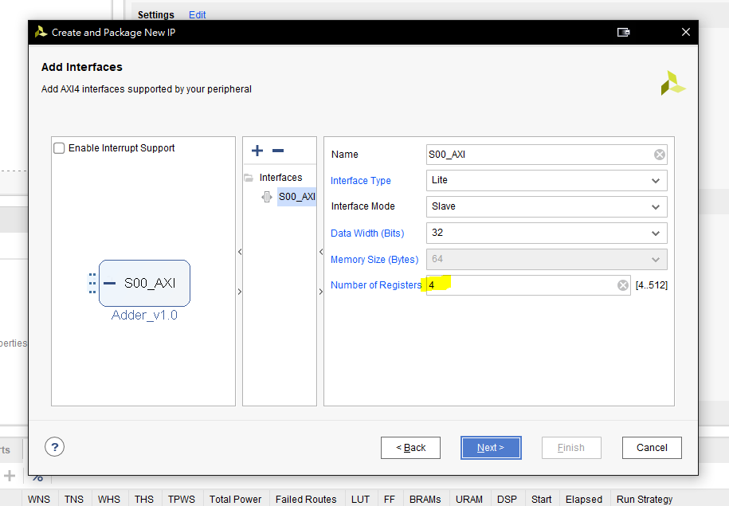

#Lab2

```
Author : 
    Jyun-Liang, Chen
    Pin-Lun, Lin
```

## 1. Outline
- [1. Outline](#1-outline)
- [2. Package Adder Wrapper](#2-package-adder-wrapper)
  - [2.1 Requirement](#21-requirement)
  - [2.2 Create New IP](#22-create-new-ip)
    - [2.2.1 Open Lab1 Project](#221-open-lab1-project)
    - [2.2.2 Create and Package New IP](#222-create-and-package-new-ip)
    - [2.2.3 Next](#223-next)
    - [2.2.4 Choose Create a newe AXI4 peripheral](#224-choose-create-a-newe-axi4-peripheral)
    - [2.2.5 Name Your IP](#225-name-your-ip)
    - [2.2.6 Input Number of Registers (Not 4)](#226-input-number-of-registers-not-4)
    - [2.2.7 Choose Edit IP](#227-choose-edit-ip)
  - [2.3 Package IP](#23-package-ip)
    - [2.3.1 Right-Click Design Sources and Click Add Sources](#231-right-click-design-sources-and-click-add-sources)
    - [2.3.2 Click Adder\_v1\_0\_S00\_AXI\.v](#232-click-adderv10s00axiv)
    - [2.3.3 Edit Adder\_v1\_0\_S00\_AXI\.v](#233-edit-adderv10s00axiv)
    - [2.3.4 Edit Adder\_v1\_0\.v](#234-edit-adderv10v)
    - [2.3.5 Click Merge changes from File Groups Wizard](#235-click-merge-changes-from-file-groups-wizard)
    - [2.3.6 Click Merge changes from Customization Parameters Wizard](#236-click-merge-changes-from-customization-parameters-wizard)
    - [2.3.7 Check and Click Re-Package IP](#237-check-and-click-re-package-ip)
    - [2.3.8 Click Settings](#238-click-settings)
    - [2.3.9 Check Custom IP](#239-check-custom-ip)
    - [2.3.10 Add Custom IP and Click Run Connection Automation](#2310-add-custom-ip-and-click-run-connection-automation)
    - [2.3.11 Click OK](#2311-click-ok)
    - [2.3.12 Finish](#2312-finish)
    - [2.3.13 Generate Bitstream and Launch SDK](#2313-generate-bitstream-and-launch-sdk)
- [3. Standalone Development](#3-standalone-development)
  - [3.1 Requirement](#31-requirement)
  - [3.2 Vivado SDK](#32-vivado-sdk)
    - [3.2.1 Launch SDK](#321-launch-sdk)
    - [3.2.2 Create Project](#322-create-project)
    - [3.2.3 Choose Hello World Template](#323-choose-hello-world-template)
    - [3.2.4 Check Custom IP Bus Address](#324-check-custom-ip-bus-address)
    - [3.2.5 撰寫程式碼(基礎 : 請填問號)](#325-%e6%92%b0%e5%af%ab%e7%a8%8b%e5%bc%8f%e7%a2%bc%e5%9f%ba%e7%a4%8e--%e8%ab%8b%e5%a1%ab%e5%95%8f%e8%99%9f)
    - [3.2.6 撰寫程式碼(進階 : Print Hardware Operate Passed)](#326-%e6%92%b0%e5%af%ab%e7%a8%8b%e5%bc%8f%e7%a2%bc%e9%80%b2%e9%9a%8e--print-hardware-operate-passed)

## 2. Package Adder Wrapper
### 2.1 Requirement

- Finish Lab1.

In this tutorial, I use :

- Xilinx Vivado 2018.3

### 2.2 Create New IP

#### 2.2.1 Open Lab1 Project

#### 2.2.2 Create and Package New IP

> Tools &rarr; Create and Package New IP ...


#### 2.2.3 Next


#### 2.2.4 Choose Create a newe AXI4 peripheral


#### 2.2.5 Name Your IP


#### 2.2.6 Input Number of Registers (Not 4)



#### 2.2.7 Choose Edit IP


### 2.3 Package IP

#### 2.3.1 Right-Click Design Sources and Click Add Sources


#### 2.3.2 Click Adder\_v1\_0\_S00\_AXI\.v


#### 2.3.3 Edit Adder\_v1\_0\_S00\_AXI\.v

```verilog
7   parameter ADDRESS_SIZE = 10,
8   parameter WORD_SIZE = 32,
9   parameter WORD_NUMBER = 1024,
```


```verilog
126 wire finish;
127 wire busy;
128 wire [WORD_SIZE-1 : 0] OUT_DATA;
```


```verilog
483 Adder #(.ADDRESS_SIZE(ADDRESS_SIZE), .WORD_SIZE(WORD_SIZE), .WORD_NUMBER(WORD_NUMBER)) M0 (
484     .IN_DATA(slv_reg0),
485     .OUT_DATA(OUT_DATA),
486     .IN_ADDR(slv_reg1[ADDRESS_SIZE-1 : 0]),
487     .OUT_ADDR(slv_reg2[ADDRESS_SIZE-1 : 0]),
488     .IN_WEN(slv_reg3[0]),
489     .OUT_CEN(slv_reg4[0]),
490     .RAM_SEL(slv_reg5[0]),
491     .start(slv_reg6[0]),
492     .finish(finish),
493     .busy(busy),
494     .CLK(S_AXI_ACLK),
495     .RST_N(S_AXI_ARESETN&&slv_reg7[0])
496 );
```


#### 2.3.4 Edit Adder\_v1\_0\.v

```verilog
7   parameter ADDRESS_SIZE = 10,
8   parameter WORD_SIZE = 32,
9   parameter WORD_NUMBER = 1024,
```


```verilog
51  .ADDRESS_SIZE(ADDRESS_SIZE), 
52  .WORD_SIZE(WORD_SIZE), 
53  .WORD_NUMBER(WORD_NUMBER),
```


#### 2.3.5 Click Merge changes from File Groups Wizard


#### 2.3.6 Click Merge changes from Customization Parameters Wizard


#### 2.3.7 Check and Click Re-Package IP


#### 2.3.8 Click Settings


#### 2.3.9 Check Custom IP 


#### 2.3.10 Add Custom IP and Click Run Connection Automation


#### 2.3.11 Click OK


#### 2.3.12 Finish


#### 2.3.13 Generate Bitstream and Launch SDK

[Lab1](../lab1/Lab1.md)

## 3. Standalone Development
### 3.1 Requirement

- Finish [2.1 Package Adder Wrapper](#2-package-adder-wrapper).
- Generate Bitsream.

In this tutorial, I use :

- Xilinx Vivado SDK 2018.3
- Zedboard
- 2 x Micro USB

### 3.2 Vivado SDK

#### 3.2.1 Launch SDK

[Lab1](../lab1/Lab1.md)

#### 3.2.2 Create Project

- File &rarr; New &rarr; Application Project


#### 3.2.3 Choose Hello World Template


#### 3.2.4 Check Custom IP Bus Address

- Adder_0 Bus Address : 0x43C00000


#### 3.2.5 撰寫程式碼(基礎 : 請填問號)

```c
#include <stdio.h>
#include "platform.h"
#include "xil_printf.h"

//Address Offset
#define IN_DATA ??
#define IN_ADDR ??
#define OUT_ADDR ??
#define IN_WEN ??
#define OUT_CEN ??
#define RAM_SEL ??
#define start ??
#define RST_N ??
#define OUT_DATA ??
#define finish ??
#define busy ??

#define WORD_NUMBER 1024
#define RAM_A 0
#define RAM_B 1

int main()
{
    init_platform();
    volatile unsigned long *base = (volatile unsigned long*) 0x43c00000;
    unsigned int i = 0;
    unsigned int count = 0;
    unsigned char is_Pass = 1;

    //Input Data Initial
    base[RST_N] = 1;
    base[RST_N] = 0;
    base[RST_N] = 1;
    base[IN_WEN] = 1;
    base[OUT_CEN] = 0;

    //Input RAM_A
    base[RAM_SEL] = RAM_A;
    for(i = 0; i < WORD_NUMBER ; i++){
    	base[IN_ADDR] = i;
    	base[IN_DATA] = i;
    }

    //Input RAM_B
    base[RAM_SEL] = RAM_B;
    for(i = 0; i < WORD_NUMBER ; i++){
    	base[IN_ADDR] = i;
        base[IN_DATA] = i;
    }

    //Start operate
    base[IN_WEN] = 0;
    base[start] = 1;
    for(count = 0; count < 10000;count++){
    	if(base[finish]&&!base[busy]){
    		xil_printf("Operate Finish.\n");
    		break;
    	}
    	else
    		if(count == 9999)
    			xil_printf("Hardware Failed.\n");
    		else{
    			xil_printf("%d.\n",count);
    			continue;
    		}
    }

    //Verification
    base[OUT_CEN] = 1;
    for(i = 0; i < WORD_NUMBER ; i++){
    	base[OUT_ADDR] = i;
    	if(base[OUT_DATA] != 2*i){
    		if(is_Pass != 0)
    			xil_printf("Hardware Operate Failed.\n");
    		xil_printf("Address = %d, OUT_DATA = %d\n", i, base[OUT_DATA]);
    		is_Pass = 0;
    		//break;
    	}
    }
    
    if(is_Pass)
    	xil_printf("Hardware Operate Passed.\n");
    else
        xil_printf("Hardware Operate Failed.\n");


    cleanup_platform();
    return 0;
}
```

#### 3.2.6 撰寫程式碼(進階 : Print Hardware Operate Passed)

- Edit Verification

```c
//Verification
    base[OUT_CEN] = 1;
    for(i = 0; i < WORD_NUMBER ; i++){
    	base[OUT_ADDR] = i;
    	if(base[OUT_DATA] != 3*i){ //Change 2*i to 3*i
    		if(is_Pass != 0)
    			xil_printf("Hardware Operate Failed.\n");
    		xil_printf("Address = %d, OUT_DATA = %d\n", i, base[OUT_DATA]);
    		is_Pass = 0;
    		//break;
    	}
    }
```