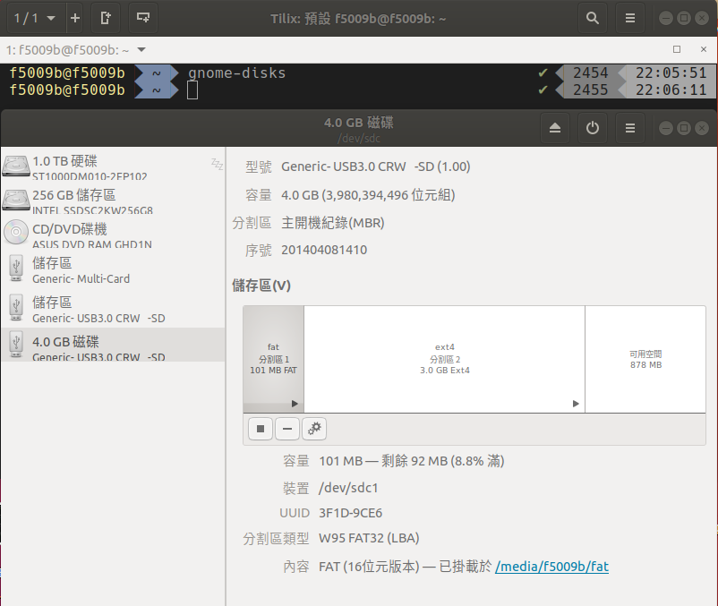
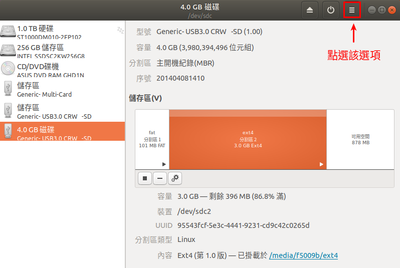
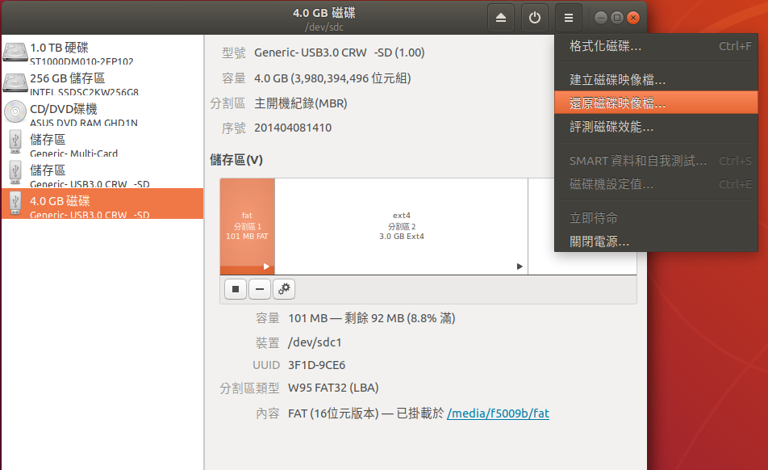
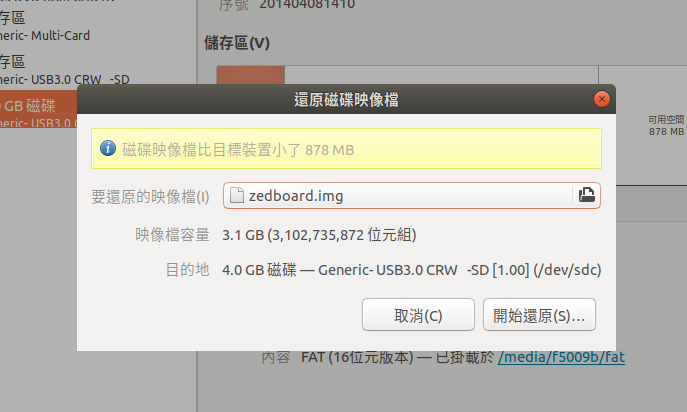
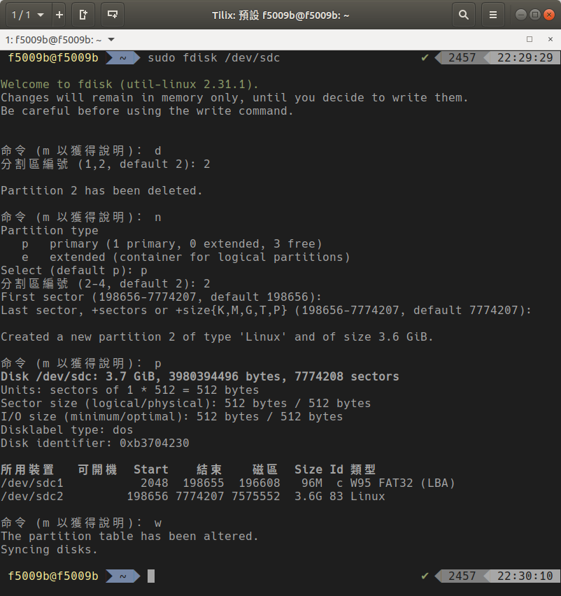
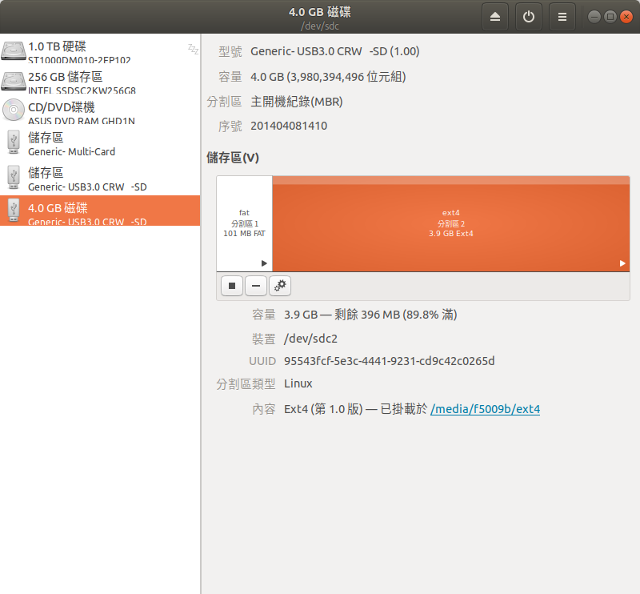

#Lab3

```
Author : 
    Jyun-Liang, Chen
    Pin-Lun, Lin
```

## 1. Outline
- [1. Outline](#1-outline)
- [2. SD Card](#2-sd-card)
  - [2.1 GNOME Disk](#21-gnome-disk)
  - [2.2 還原映像檔](#22-%e9%82%84%e5%8e%9f%e6%98%a0%e5%83%8f%e6%aa%94)
  - [2.3 選擇映像檔](#23-%e9%81%b8%e6%93%87%e6%98%a0%e5%83%8f%e6%aa%94)
  - [2.4 延伸磁區(*按錯就完了*)](#24-%e5%bb%b6%e4%bc%b8%e7%a3%81%e5%8d%80%e6%8c%89%e9%8c%af%e5%b0%b1%e5%ae%8c%e4%ba%86)
- [3. Petalinux](#3-petalinux)
  - [3.1 Clear Petalinux Project](#31-clear-petalinux-project)
  - [3.2 Configure Petalinux Project](#32-configure-petalinux-project)
  - [3.3 Create Kernel Module Template](#33-create-kernel-module-template)
  - [3.4 Build Kernel Modules](#34-build-kernel-modules)
- [4. Kernel Module](#4-kernel-module)
  - [4.1 掛載/卸載](#41-%e6%8e%9b%e8%bc%89%e5%8d%b8%e8%bc%89)
  - [4.2 Hello World (60)](#42-hello-world-60)
    - [4.2.1 MODULE_LICENSE](#421-modulelicense)
    - [4.2.2 module_init](#422-moduleinit)
    - [4.2.2 module_exit](#422-moduleexit)
    - [4.2.3 printk](#423-printk)
    - [4.2.4 其他printk優先度](#424-%e5%85%b6%e4%bb%96printk%e5%84%aa%e5%85%88%e5%ba%a6)
  - [4.3 Read Hardware Value (20)](#43-read-hardware-value-20)
  - [4.4 Write Character Device (20)](#44-write-character-device-20)


## 2. SD Card

### 2.1 GNOME Disk

```bash
gnome-disks
```



### 2.2 還原映像檔






### 2.3 選擇映像檔



### 2.4 延伸磁區(*按錯就完了*)





## 3. Petalinux

### 3.1 Clear Petalinux Project

```bash
petalinux-build -x distclean
```

### 3.2 Configure Petalinux Project

- HDF 請至網大下載

```bash
petalinux-config --get-hw-description=<Vivado_Export_to_SDK_Directory>
```

### 3.3 Create Kernel Module Template

```bash
petalinux-create -t modules -n <Kernel Module File Name>
```

### 3.4 Build Kernel Modules

```bash
petalinux-build -s <Kernel Module File Name>
```

## 4. Kernel Module

### 4.1 掛載/卸載

```bash
insmod kernel_module.ko
rmmod kernel_module.ko
```

### 4.2 Hello World (60)

```c
#include <linux/init.h>
#include <linux/module.h>

MODULE_LICENSE("Dual BSD/GPL);

static int __init hello_init(void){
    printk(KERN_INFO "Hello World!\n");
    return 0;
}

static void __exit hello_exit(void){
    printk(KERN_INFO "Goodbye World!\n");
}

module_init(hello_init);
module_exit(hello_exit);

```

#### 4.2.1 MODULE_LICENSE
- 宣告這份Kernel Module 遵守自由授權條款(沒打沒差)

#### 4.2.2 module_init
- insmod時要執行哪個函式

#### 4.2.2 module_exit
- rmmod時要執行哪個函式

#### 4.2.3 printk
- Kernel版的printf
- KERN_INFO 為訊息優先度

#### 4.2.4 其他printk優先度
[參考網站](https://elinux.org/Debugging_by_printing)

|Name | String | Meaning |
| :------------ | :-----------: | :----------- |
|KERN_EMERG    |  "0" |Emergency messages, system is about to crash or is unstable |
|KERN_ALERT    |  "1" |Something bad happened and action must be taken immediately |
|KERN_CRIT     |  "2" |A critical condition occurred like a serious hardware/software failure |
|KERN_ERR      |  "3" |An error condition, often used by drivers to indicate difficulties with the hardware|
|KERN_WARNING  |  "4" |A warning, meaning nothing serious by itself but might indicate problems |
|KERN_NOTICE   |  "5" |Nothing serious, but notably nevertheless. Often used to report security events |
|KERN_INFO     |  "6" |Informational message e.g. startup information at driver initialization |
|KERN_DEBUG    |  "7" |Debug messages |


### 4.3 Read Hardware Value (20)


### 4.4 Write Character Device (20)
