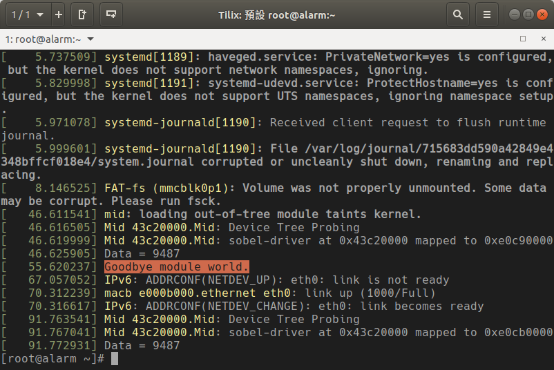

# Lab3

```
Author : 
    Jyun-Liang, Chen
    Pin-Lun, Lin
```

## 1. Outline
- [1. Outline](#1-outline)
- [2. SD Card (虛擬機)](#2-sd-card-%e8%99%9b%e6%93%ac%e6%a9%9f)
  - [2.1 GNOME Disk](#21-gnome-disk)
  - [2.2 還原映像檔](#22-%e9%82%84%e5%8e%9f%e6%98%a0%e5%83%8f%e6%aa%94)
  - [2.3 選擇映像檔](#23-%e9%81%b8%e6%93%87%e6%98%a0%e5%83%8f%e6%aa%94)
- [3. Petalinux (Server)](#3-petalinux-server)
  - [3.1 Clear Petalinux Project](#31-clear-petalinux-project)
  - [3.2 Configure Petalinux Project](#32-configure-petalinux-project)
  - [3.3 Create Kernel Module Template](#33-create-kernel-module-template)
  - [3.4 Build Kernel Modules](#34-build-kernel-modules)
- [4. Kernel Module](#4-kernel-module)
  - [4.1.1 掛載](#411-%e6%8e%9b%e8%bc%89)
  - [4.1.2 卸載](#412-%e5%8d%b8%e8%bc%89)
  - [4.2 Hello World (50%)](#42-hello-world-50)
    - [4.2.1 MODULE_LICENSE](#421-modulelicense)
    - [4.2.2 module_init](#422-moduleinit)
    - [4.2.2 module_exit](#422-moduleexit)
    - [4.2.3 printk](#423-printk)
    - [4.2.4 其他printk優先度](#424-%e5%85%b6%e4%bb%96printk%e5%84%aa%e5%85%88%e5%ba%a6)
  - [4.3 Read Hardware Value (30%)](#43-read-hardware-value-30)
  - [4.4 Write Character Device (20%)](#44-write-character-device-20)


## 2. SD Card (虛擬機)

### 2.1 GNOME Disk

```bash
gnome-disks
```


### 2.2 還原映像檔


### 2.3 選擇映像檔


## 3. Petalinux (Server)

### 3.1 Clear Petalinux Project

```bash
petalinux-build -x distclean
```

### 3.2 Configure Petalinux Project

- HDF 請至網大下載

```bash
petalinux-config --get-hw-description=<Vivado_Export_to_SDK_Directory>
```

### 3.3 Create Kernel Module Template

```bash
petalinux-create -t modules -n <Kernel Module File Name>
```

### 3.4 Build Kernel Modules

```bash
petalinux-build -c <Kernel Module File Name>
```

## 4. Kernel Module

### 4.1.1 掛載

```bash
insmod kernel_module.ko
```

### 4.1.2 卸載

```bash
rmmod kernel_module.ko
```

### 4.2 Hello World (50%)

- 使用petalinux-create建立driver模本
```bash
petalinux-create -t modules -n <module_name>
```

```c
#include <linux/init.h>
#include <linux/module.h>

MODULE_LICENSE("Dual BSD/GPL");

static int __init hello_init(void){
    printk(KERN_INFO "Hello World!\n");
    return 0;
}

static void __exit hello_exit(void){
    printk(KERN_INFO "Goodbye World!\n");
}

module_init(hello_init);
module_exit(hello_exit);

```

#### 4.2.1 MODULE_LICENSE
- 宣告這份Kernel Module 遵守自由授權條款(沒打沒差)

#### 4.2.2 module_init
- insmod時要執行哪個函式

#### 4.2.2 module_exit
- rmmod時要執行哪個函式

#### 4.2.3 printk
- Kernel版的printf
- KERN_INFO 為訊息優先度

#### 4.2.4 其他printk優先度
[參考網站](https://elinux.org/Debugging_by_printing)

|Name | String | Meaning |
| :------------ | :-----------: | :----------- |
|KERN_EMERG    |  "0" |Emergency messages, system is about to crash or is unstable |
|KERN_ALERT    |  "1" |Something bad happened and action must be taken immediately |
|KERN_CRIT     |  "2" |A critical condition occurred like a serious hardware/software failure |
|KERN_ERR      |  "3" |An error condition, often used by drivers to indicate difficulties with the hardware|
|KERN_WARNING  |  "4" |A warning, meaning nothing serious by itself but might indicate problems |
|KERN_NOTICE   |  "5" |Nothing serious, but notably nevertheless. Often used to report security events |
|KERN_INFO     |  "6" |Informational message e.g. startup information at driver initialization |
|KERN_DEBUG    |  "7" |Debug messages |


### 4.3 Read Hardware Value (30%)
- 使用petalinux-create建立driver模本
```bash
petalinux-create -t modules <module_name>
```
- Template
```c
#include <linux/kernel.h>
#include <linux/init.h>
#include <linux/module.h>
#include <linux/slab.h>
#include <linux/of_address.h>
#include <linux/of_device.h>
#include <linux/of_platform.h>

/* Standard module information, edit as appropriate */
MODULE_LICENSE("GPL");

#define DRIVER_NAME "Mid"

//用來存放硬體資訊
struct sobel_driver_local {
	unsigned long mem_start; //存放IO Address的起點
	unsigned long mem_end;   //存放IO Address的終點
	void __iomem *base_addr; //存放IO Address映射至哪個Virtual Address
};


//初始化函式
static int sobel_driver_probe(struct platform_device *pdev)
{
	struct resource *r_mem; /* IO mem resources */
	struct device *dev = &pdev->dev;
	struct sobel_driver_local *lp = NULL;

	int rc = 0;
	dev_info(dev, "Device Tree Probing\n");
	/* 將Device Tree的資訊提取出來 */
	r_mem = platform_get_resource(pdev, IORESOURCE_MEM, 0);
	
    if (!r_mem) {
		dev_err(dev, "invalid address\n");
		return -ENODEV;
	}
    //替自己寫的struct分配一塊記憶體空間
	lp = (struct sobel_driver_local *) kmalloc(sizeof(struct sobel_driver_local), GFP_KERNEL);
	if (!lp) {
		dev_err(dev, "Cound not allocate sobel-driver device\n");
		return -ENOMEM;

	dev_set_drvdata(dev, lp);
    //將提取出來的資訊儲存至自己寫的strut中
	lp->mem_start = r_mem->start;
	lp->mem_end = r_mem->end;

    //在作業系統中保留一塊記憶體區塊
	if (!request_mem_region(lp->mem_start,
				lp->mem_end - lp->mem_start + 1,
				DRIVER_NAME)) {
		dev_err(dev, "Couldn't lock memory region at %p\n",
			(void *)lp->mem_start);
		rc = -EBUSY;
		goto error1;
	}

    //將IO Address的記憶體映射至Virtual Address
	lp->base_addr = ioremap(lp->mem_start, lp->mem_end - lp->mem_start + 1);
	if (!lp->base_addr) {
		dev_err(dev, "sobel-driver: Could not allocate iomem\n");
		rc = -EIO;
		goto error2;
	}

	dev_info(dev,"sobel-driver at 0x%08x mapped to 0x%08x\n",
		(unsigned int __force)lp->mem_start,
		(unsigned int __force)lp->base_addr);
    
	/*
	*	請參考Lab2
	*	如何將OUTPUT的值印出來
	*	Hint:
	*		printf("%d\n",data);(注意這是SDK的寫法)
	*/
	
	return 0;


error2:
    //釋放被作業系統保留的記憶體區塊
	release_mem_region(lp->mem_start, lp->mem_end - lp->mem_start + 1);
error1:
    //將kmalloc分配的記憶體釋放掉
	kfree(lp);
    //將指標清空
	dev_set_drvdata(dev, NULL);
	return rc;
}

//卸載函式
static int sobel_driver_remove(struct platform_device *pdev)
{
	struct device *dev = &pdev->dev;
	struct sobel_driver_local *lp = dev_get_drvdata(dev);
    //取消IO Address與Virtual address之間的映射
	iounmap(lp->base_addr);
    //釋放被作業系統保留的記憶體區塊
	release_mem_region(lp->mem_start, lp->mem_end - lp->mem_start + 1);
    //將kmalloc分配的記憶體釋放掉
	kfree(lp);
    //將指標清空
	dev_set_drvdata(dev, NULL);
	return 0;
}

//設定"sobel_driver_of_match"要取得哪個Deivce Tree的資訊
#ifdef CONFIG_OF
static struct of_device_id sobel_driver_of_match[] = {
	{ .compatible = "xlnx,Mid-1.0", },
	{ /* end of list */ },
};
MODULE_DEVICE_TABLE(of, sobel_driver_of_match);
#else
# define sobel_driver_of_match
#endif

//設定Driver的資訊
//設定Driver被註冊或是註銷時要執行哪個函式
//設定Driver的of_device_id(Device Tree的資訊)為何
static struct platform_driver sobel_driver_driver = {
	.driver = {
		.name = DRIVER_NAME,
		.owner = THIS_MODULE,
		.of_match_table	= sobel_driver_of_match,
	},
	.probe		= sobel_driver_probe,
	.remove		= sobel_driver_remove,
};

static int __init sobel_driver_init(void)
{
    printk(KERN_ALERT "Hello world.\n");
	return platform_driver_register(&sobel_driver_driver);
}

static void __exit sobel_driver_exit(void)
{
	platform_driver_unregister(&sobel_driver_driver);
	printk(KERN_ALERT "Goodbye module world.\n");
}

//設定Driver註冊時要執行什麼
module_init(sobel_driver_init);

//設定Driver註銷時要執行什麼
module_exit(sobel_driver_exit);
```

- 完成圖



### 4.4 Write Character Device (20%)

- 使用剛剛做的driver

- g++ main_lite.cpp -lopencv_core -lopencv_imgproc -lopencv_imgcodecs -lopencv_highgui

- 完成圖

- 軟體運算結果
  


- 硬體運算結果
  

